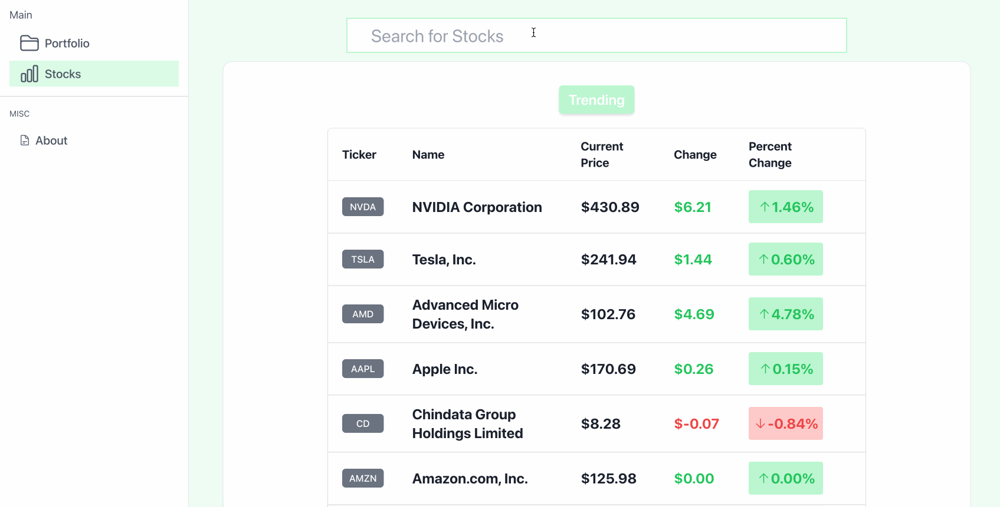

# stocksimulator


A quick and easy web application to build your stock portfolio. Search for your favorite stocks and add them to your portfolio through a simple UI. The application will track your portfolio through your browsers storage and allow real time updates to determine how your portfolio is doing using external APIs.


## FrontEnd Endpoints

Method	| Path	| Description	|
------------- | ------------------------- | ------------- |
GET	| /	| Index page. View your portfolio here| 	
GET	| /stocks	| Trending stocks page and Stock search feature|
GET	| /stocks/<str:ticker>	| Ticker data of a specific stock. Includes Graph and common markers	|
GET | /trade/<str:ticker> | Buy screen for a ticker|
GET	| /<str:purchasid>	| Register new account	|


## BackEnd REST Endpoints
Method	| Path	| Description	|
------------- | ------------------------- | ------------- |
GET	| /trending	| Get trending tickers and their data| 	
GET	| /ticker/<str:ticker>/'| Get specified ticker data	|
GET	| search/<str:query>/	| Grab search query results from the given query	|
GET	| portfolio/<str:tickers>/| Grab ticker data for the stocks in your portfolio	|


## Running Locally

If you wanted to test this application out locally, you can run the developement servers locally using docker.


1. **Clone the repository:**
    Open your favorite 
   ```sh
   git clone https://github.com/cakuang1/stocksimulator/
   cd stocksimulator/

2. **Build containers:**

    ```sh
    docker-compose up --build

3. **Browser:**
    The frontend and backend containers should now be running on ports 3000 and 8000 respectively.
     Open a web browser and navigate to http://localhost:3000. The application should working.
4. **Stop Containers**
    When finished, stop the containers by either running docker-compose down, or manually stopping the containers on docker desktop.

## Demo




## Created Using

- React (Front End)
- Django (Back End) 
- Yahoo Query (External API/Webscraper)
- ApeWisom (External API for trending list)
- Misc
    - Pandas (Working with yahoo queries historical data)
    - Djanjo REST Framework
    - HeroIcons (for free icons)
## How this works
- Django works as a proxy server in order to call the external API. There is no database involved. 
- YahooQuery feeds data to the backend (Simply a webscraper that scrapes Yahoo Finannce)
- Django transforms this data and sends it to the client to allow for real-time stock information
## Features
-Live Search - Search for your favorite stocks through the live search bar.
-Live Stock Information - Stock Information display (Graph,Live Prices)
-Portfolio Tracking - Allows for your purchased stocks to be tracked through your browsers local storage and added on 


